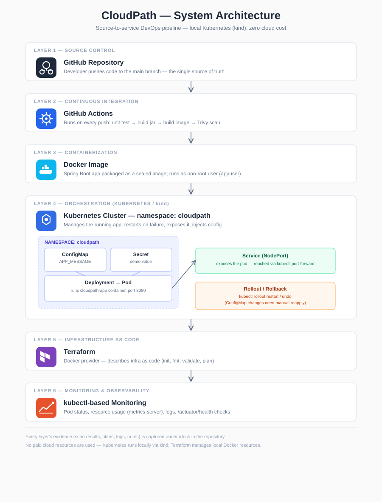

# CloudPath — Self-Service Deployment Platform

A complete DevOps pipeline built as an individual internship project: taking a small Spring Boot application from source code to a live, monitored, recoverable service — using Docker, GitHub Actions, Kubernetes, and Terraform, entirely on local infrastructure at zero cloud cost.

**Repository:** https://github.com/Dakshinab/cloudpath-devops

---

## Overview

CloudPath demonstrates the full software delivery journey a DevOps engineer is responsible for:

```
Push code → CI checks (test, build, scan) → Docker image → Kubernetes deployment → Monitoring & recovery
```

The project proves not just that the application runs, but that it can be built, tested, secured, deployed, updated, rolled back, and observed — using the same tools and practices used in real production environments, scaled down to run safely and freely on a local machine.

---

## Architecture



```

- **Developer** pushes code to GitHub
- **GitHub Actions** automatically tests, builds, and scans the code on every push
- **Docker** packages the application into a portable, secure container
- **Kubernetes** (via `kind`, running locally) runs and manages the container
- **Terraform** describes supporting infrastructure as code
- **Monitoring** tracks pod health, resource usage, and application logs

---

## Tech stack

| Area | Tool |
|---|---|
| Language | Java 21 |
| Framework | Spring Boot 4.1 |
| Build tool | Maven |
| Containerization | Docker |
| CI/CD | GitHub Actions |
| Orchestration | Kubernetes (`kind` — local, zero cloud cost) |
| Infrastructure as Code | Terraform (Docker provider) |
| Security scanning | Trivy |
| Monitoring | `kubectl` (pod status, logs, resource metrics) |

---

## Application endpoints

| Endpoint | Purpose |
|---|---|
| `GET /tasks` | Returns a sample task list |
| `GET /actuator/health` | Health check — used by Kubernetes and for manual monitoring |
| `GET /info` | Returns a configurable message, supplied via the `APP_MESSAGE` environment variable / Kubernetes ConfigMap |

The application logs to stdout by default, reads configuration from environment variables, and includes an automated test that verifies the health endpoint.

---

## Project structure

```
cloudpath-devops/
├── src/                          # Spring Boot application source and tests
├── .github/workflows/ci.yml      # CI pipeline (test, build, Docker, Trivy scan)
├── k8s/                          # Kubernetes manifests
│   ├── namespace.yaml
│   ├── configmap.yaml
│   ├── secret.yaml
│   ├── deployment.yaml
│   └── service.yaml
├── terraform/                    # Infrastructure as Code (Docker provider)
│   └── main.tf
├── docs/                         # Evidence: scan results, plans, monitoring, notes
├── Dockerfile
├── .dockerignore
├── pom.xml
└── README.md
```

---

## Running the application

### Locally

```bash
./mvnw spring-boot:run
```
App available at `http://localhost:8080`.

### With Docker

```bash
./mvnw clean package -DskipTests
docker build -t cloudpath-app .
docker run --name cloudpath-app-container -p 8080:8080 cloudpath-app
```
The container runs as a non-root user (`appuser`) for security, and excludes unnecessary files via `.dockerignore`.

### On Kubernetes (local, via `kind`)

```bash
kind create cluster --name cloudpath-cluster
kind load docker-image cloudpath-app --name cloudpath-cluster

kubectl apply -f k8s/namespace.yaml
kubectl apply -f k8s/configmap.yaml
kubectl apply -f k8s/secret.yaml
kubectl apply -f k8s/deployment.yaml
kubectl apply -f k8s/service.yaml

kubectl port-forward -n cloudpath svc/cloudpath-service 8080:8080
```
App then available at `http://localhost:8080`, same behavior as running locally or via Docker.

**Kubernetes objects used:**
- **Namespace** (`cloudpath`) — groups all project resources
- **ConfigMap** — supplies `APP_MESSAGE` as an environment variable
- **Secret** — demonstrates safe handling of sensitive values (demo value only, no real secrets)
- **Deployment** — runs the container as a pod and restarts it automatically if it fails
- **Service** (NodePort) — exposes the app so it can be reached from outside the cluster

---

## CI/CD pipeline

Every push to `main` automatically triggers a GitHub Actions workflow (`.github/workflows/ci.yml`) that:

1. Checks out the code
2. Sets up Java 21
3. Runs the automated test suite
4. Builds the application jar
5. Builds the Docker image
6. Installs Trivy and runs a security scan

A successful run shows a green checkmark on the repository's Actions tab — this is the evidence that the pipeline works end to end, on every change.

---

## Security

- **Non-root container user:** the app runs inside Docker/Kubernetes as a restricted user (`appuser`), not root, limiting the impact of any potential compromise
- **`.dockerignore`:** excludes build artifacts, Git history, and other unnecessary files from the image
- **Trivy scanning:** every image is scanned for known vulnerabilities in the base OS and Java dependencies; results are saved in `docs/trivy-scan-week2.txt`. No critical vulnerabilities were found; medium/high findings all have documented fixed versions available
- **Kubernetes Secret:** demonstrates safe secret handling patterns without committing real credentials

---

## Infrastructure as Code (Terraform)

Terraform manages a local Docker container as a stand-in for cloud infrastructure — deliberately avoiding AWS or any paid cloud resources, per the project's cost-control constraint.

```bash
cd terraform
terraform init
terraform fmt
terraform validate
terraform plan
```

Plan output is captured as evidence in `docs/terraform-plan-week5.txt`.

---

## Release rollout and rollback

Demonstrated by updating the `APP_MESSAGE` ConfigMap value, rolling it out, and testing rollback:

```bash
kubectl apply -f k8s/configmap.yaml
kubectl rollout restart deployment/cloudpath-deployment -n cloudpath
kubectl rollout status deployment/cloudpath-deployment -n cloudpath
kubectl rollout undo deployment/cloudpath-deployment -n cloudpath
```

**Key finding:** `kubectl rollout undo` only reverts settings defined directly on the Deployment (image, replicas, inline env vars) — it does **not** revert a separately managed ConfigMap's content, since ConfigMaps have their own lifecycle independent of Deployment rollout history. Recovering a ConfigMap change requires manually reapplying a prior version (e.g. from Git history). Full write-up: `docs/week6-rollout-rollback-notes.md`.

---

## Monitoring

Minimum monitoring is captured using standard `kubectl` tooling:

- **Pod health:** `kubectl get pods -n cloudpath` — status and restart count
- **Resource usage:** `kubectl top pods -n cloudpath` (via metrics-server, installed with `--kubelet-insecure-tls` for local cluster compatibility)
- **Application logs:** `kubectl logs -n cloudpath <pod-name>`
- **Health endpoint:** `curl http://localhost:8080/actuator/health`

Evidence and a documented failure-detection approach are saved in `docs/week7-monitoring-evidence.txt`, `docs/week7-app-logs.txt`, and `docs/week7-monitoring-notes.md`.

---

## Evidence and documentation index

| File | Contents |
|---|---|
| `docs/trivy-scan-week2.txt` | Docker image security scan results |
| `docs/terraform-plan-week5.txt` | Terraform plan output |
| `docs/week6-rollout-rollback-notes.md` | Rollout/rollback exercise and findings |
| `docs/week7-monitoring-evidence.txt` | Pod status and resource usage |
| `docs/week7-app-logs.txt` | Application logs |
| `docs/week7-monitoring-notes.md` | Monitoring approach and failure-detection notes |

---

## Project status

- [x] Week 1 — Application built (endpoints, health check, env-based config, test)
- [x] Week 2 — Dockerized (Dockerfile, .dockerignore, non-root user, Trivy scan)
- [x] Week 3 — CI pipeline (GitHub Actions: test, build, Docker, Trivy scan on every push)
- [x] Week 4 — Kubernetes deployment (namespace, configmap, secret, deployment, service)
- [x] Week 5 — Terraform infrastructure (Docker provider, init/fmt/validate/plan)
- [x] Week 6 — Release rollout/rollback testing
- [x] Week 7 — Monitoring and documentation
- [ ] Week 8 — Final demo and submission

---

## Author

**Dakshina Dissanayake**
DevOps Engineer Intern — Codezela Technologies